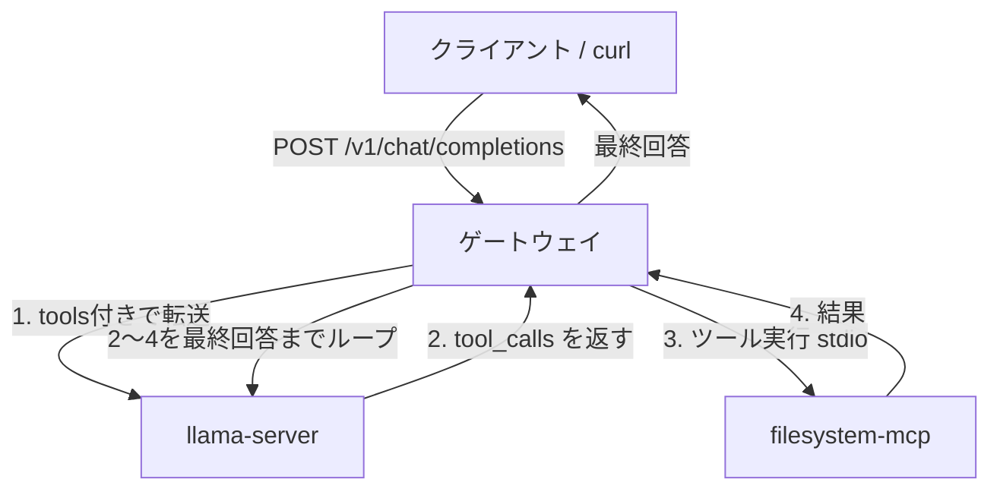
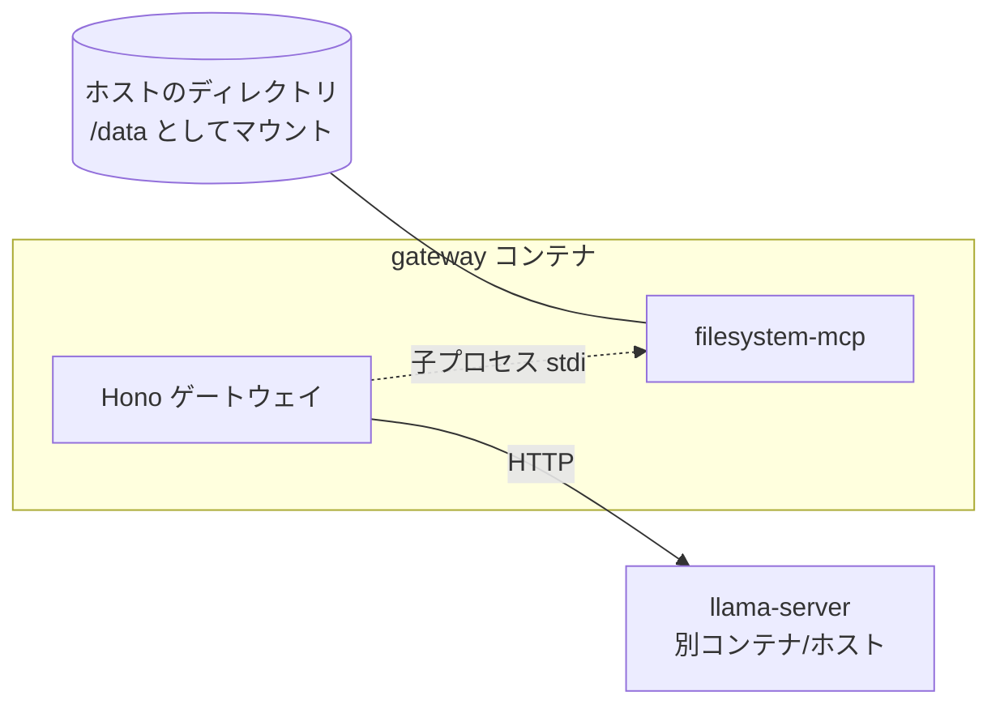

# MCPゲートウェイ（llama-server向けOpenAIアダプター）設計

- 日付: 2026-06-19
- ステータス: 承認済み（実装計画へ）

## 目的

llama-server はOpenAI互換APIサーバーだが **MCPクライアント機能を持たない**ため、既存のMCPサーバー（filesystem-mcp など）を利用できない。本プロジェクトは、その橋渡しをする単一のゲートウェイを作る。

クライアントが普通にチャットを送り、モデルがツールを使うと判断したら、ゲートウェイが裏で対応するMCPを実行して結果を会話に戻す。クライアントは「ツールが使えるOpenAI互換エンドポイント」を1つ叩くだけで済む。

主用途は **llama-server**。Claude Code / Gemini CLI / opencode は元々ネイティブにMCPへ接続できるため、本ゲートウェイを必要としない（よって対象外）。

## スコープ

- **やること**: OpenAI互換 `/v1/chat/completions` を提供し、内部で子MCP（stdio）を束ねてツールとして公開し、tool_calls↔MCP実行のエージェントループを回す。
- **やること（ベストエフォート）**: ユーザーが「〇〇を使って」とツール／子MCPを名指ししたら、OpenAI `tool_choice` でそのツールを強制する。検出できないときは `tool_choice: "auto"` にフォールバックする（絶対遵守ではなく、あくまで誘導）。
- **やらないこと**: 標準MCPサーバー（Streamable HTTP）としての公開、Claude/Gemini向けの共有ハブ化、認証、ストリーミング（いずれも将来の拡張余地として残すが今回は作らない）。

## アーキテクチャ

単一サーバー。OpenAI互換APIで待ち受け、内部で子MCPを呼ぶエージェントループを回す。



処理の流れ:

1. クライアントが `/v1/chat/completions` に通常のチャットリクエストを送る。
2. ゲートウェイが子MCPのツール一覧を OpenAI `tools` 形式に変換して付け、`LLAMA_BASE_URL` の llama-server に転送する。
3. モデルが `tool_calls` を返したら、ゲートウェイが該当する子MCPを実行する。
4. 実行結果を会話履歴（`role: "tool"` メッセージ）に追加し、再度 llama-server に送る。
5. `tool_calls` が返らなくなる（最終回答）まで 2〜4 を繰り返す。最終回答だけをクライアントに返す。
6. 無限ループ防止のため、ツール実行の反復回数に上限（`MAX_TOOL_ITERATIONS`）を設ける。上限到達時はその時点の内容を返す。

## コンポーネント構成

```
mcp-gateway/
├── package.json
├── servers.json              # 子MCPの定義（追加はここに1ブロック足すだけ）
├── .env.example              # LLAMA_BASE_URL, PORT, MAX_TOOL_ITERATIONS をコメント付きで
├── Dockerfile
├── compose.yaml              # 動作確認用（gateway 単体 / gateway+llama-server の例）
├── src/
│   ├── index.ts              # 起動: 設定読み込み → 子MCP接続 → HTTP待受
│   ├── config.ts             # servers.json と環境変数の読み込み・検証(zod)
│   ├── mcp-registry.ts       # 子MCPをstdioで起動・接続、ツール一覧の集約と実行
│   ├── tools.ts              # MCPツール定義 ⇄ OpenAI function定義 の変換
│   ├── tool-choice.ts        # ユーザー発話から名指しツールを検出 → tool_choice を決定
│   ├── agent-loop.ts         # tool_calls↔MCP実行のループ（反復上限つき）
│   └── server.ts             # /v1/chat/completions エンドポイント(Hono)
└── README.md
```

各ユニットの責務（1ユニット1目的）:

| ファイル | 何をする | 依存 |
|---|---|---|
| `config.ts` | `servers.json`・env を読んで検証した設定を返す | zod |
| `mcp-registry.ts` | 子MCPの起動/接続、`listTools`、`callTool` を提供 | MCP SDK (Client + StdioClientTransport) |
| `tools.ts` | MCPのツールschema → OpenAI `tools` 形式に変換、tool_call の引数を逆引き | — |
| `tool-choice.ts` | 最新ユーザー発話＋利用可能ツール名から、名指しを検出し `tool_choice` を返す純粋関数。未検出は `"auto"` | — |
| `agent-loop.ts` | 1リクエスト分のループ。llama-server呼び出し→tool実行→再呼び出し。初回呼び出しの `tool_choice` は tool-choice.ts で決定 | mcp-registry, tools, tool-choice |
| `server.ts` | HTTPで受けて agent-loop に渡し、結果を返す | agent-loop |

境界の確認:
- `tools.ts` / `tool-choice.ts` は純粋な変換・判定ロジックで、外部I/Oを持たない（単体テスト可能）。
- `mcp-registry.ts` は子MCPのライフサイクルと実行を隠蔽し、`agent-loop.ts` からは「ツール一覧を返す／名前と引数で呼ぶ」インターフェースだけ見える。
- `agent-loop.ts` は llama-server と mcp-registry をモックすれば単体テストできる。

## 技術スタック

- Node.js + TypeScript / pnpm
- MCP接続: `@modelcontextprotocol/sdk`（`Client` + `StdioClientTransport`）
- HTTPサーバー: Hono（軽量・TS型推論・将来のSSE対応が容易）
- 検証: zod / テスト: vitest / フォーマット: biome
- 子MCP第1号: filesystem 系MCP（`@modelcontextprotocol/server-filesystem`、依存少・APIキー不要）

> 注: 子MCPの正確なパッケージ名・引数は実装時に公式ドキュメント(context7/MCP docs)で確認する。

## 設定

`servers.json` — 子MCPの定義。追加はここに1ブロック足すだけ:

```jsonc
{
  "filesystem": {
    "command": "npx",
    "args": ["-y", "@modelcontextprotocol/server-filesystem", "/data"]
  }
}
```

環境変数（`.env.example` にコメント付きで記載）:

- `LLAMA_BASE_URL` — llama-server のベースURL（例: `http://llama:8080`）
- `PORT` — ゲートウェイの待受ポート
- `MAX_TOOL_ITERATIONS` — エージェントループのツール実行反復上限（無限ループ防止）

## エラー処理（最小限）

- **子MCPの起動失敗**: その子MCPだけ無効化して、残りで起動を継続する（可用性重視）。**失敗時は警告ログを出す**。
- **ツール実行エラー**: そのツール結果に error 内容を入れてLLMに戻す（モデルが対処・リトライできる）。
- **反復上限到達**: ループを打ち切り、その時点の内容を返す。

## Docker構成



- 子MCPはコンテナ内で stdio の子プロセスとして起動するため、イメージに **Node + npx が必要**。
- filesystem-mcp が操作する対象ディレクトリは **volume でマウント**（例: ホストの作業フォルダ → コンテナの `/data`）。
- llama-server は別。`LLAMA_BASE_URL` で指す（同一 docker network なら `http://llama:8080`、ホスト上なら `host.docker.internal`）。
- 成果物: `Dockerfile` と動作確認用 `compose.yaml`。

## テスト方針

- `tools.ts`（変換ロジック）: 純粋関数のユニットテスト。MCPツールschema → OpenAI function定義、tool_call → MCP呼び出し引数の逆変換を検証。
- `tool-choice.ts`: ユーザー発話にツール／子MCP名が含まれる場合に該当 `tool_choice` を返す、含まれない／曖昧な場合は `"auto"` を返す、を検証。
- `agent-loop.ts`: llama-server と子MCPをモックして、(1) ツール呼び出し→実行→最終回答のループ、(2) 反復上限での打ち切り、(3) ツールエラーを結果に詰めて継続、(4) 名指し時に初回 `tool_choice` が固定される、を検証。
- `mcp-registry.ts`: 実際の filesystem-mcp を1つ起動する軽い統合テスト（起動・listTools・callTool）。子MCP失敗時に警告ログを出して継続することも確認。
- `config.ts`: 不正な `servers.json` / 必須 env 欠落を弾くテスト。
- 手動E2E: Docker で起動し、`curl` で `/v1/chat/completions` に「/data の中身を見て」と投げ、filesystem ツールが実行されることを確認。

## 将来の拡張余地（今回はやらない）

- `/v1/chat/completions` のストリーミング（SSE）対応。
- 標準MCPサーバー（Streamable HTTP）としての公開 → Claude/Gemini/opencode の共有ハブ化。
- brave-search / playwright など子MCPの追加（`servers.json` への追記のみ）。
